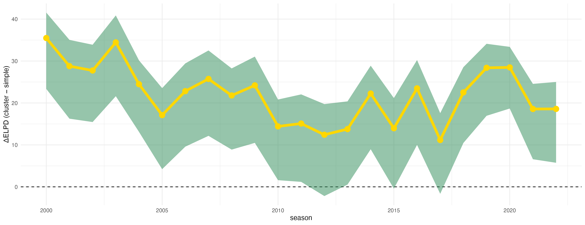

# **"Bradley–Terry meets Stochastic Block Models: Clustering Players from Pairwise Comparisons"**  

Lapo Santi, Nial Friel — University College Dublin

This repo reproduces the results of the paper and relies on the **[`BTSBM`]([https://laposanti](https://github.com/laposanti/BTSBM))** R package for model implementation and MCMC.
 

---

## 🔍 What’s inside (lean & focused)

- **Scripts at repo root**
  - `RUN_MCMC.R` — run the code across the 22 seasons of male ATP tennis tournaments. 
  - `multiple_seasons_analysis.R` — post_processes all seasons, saving tables and plots
  - `single_season_analysis.R` — post_processes just the selected season, saving tables and plots
  - `Model comparison` - compares the BT model with the BT-SBM proposed model.

- **`Pre-computed outputs**:
  - `images/` — figures used in the paper (PNG + a LaTeX table).

> If `results/` or `images/` are missing, the scripts will create them.

---

## ▶️ Multiple-Season Analysis

### 1) Install & load

```r
# install once (adjust to your GitHub origin if needed)
# install.packages("devtools")
devtools::install_github("laposanti/BTSBM")

library(BTSBM)
```

### 2) Run the sampler across seasons
Place yourself in the repo root and run:
```r
dir.create("results", showWarnings = FALSE, recursive = TRUE)
dir.create("images",  showWarnings = FALSE, recursive = TRUE)

source("multiple_seasons_analysis.R")
```

What it does:

- Iterates over all ATP seasons provided by BTSBM::ATP_2000_2022.

- Prints the season under analysis (with quick stats).

- Saves one file:

results/augmented_multiple_seasonsGN1.rds

### 3) Generate cross-season figures & tables

```r
source("postprocessing.R")
```

Outputs (preview below) are written to `images/`.

### 📊 Figures — Multiple Seasons 

The following table maps each figure in the paper to its generating code and output file, with a live thumbnail preview.

| Description | Script / Object | Preview | Output file |
|---|---|----|---|
| P(Top block) by season — jittered points | `postprocessing.R` / `p_top_across_time` | <a href="./images/Ptop_across_time.png"></a> | [`images/Ptop_across_time.png`](./images/Ptop_across_time.png) |
| Shannon entropy across seasons (mean with 90% band) | `postprocessing.R` / `entropy_plot` | <a href="./images/entropy_plot.png"></a> | [`images/entropy_plot.png`](./images/entropy_plot.png) |
| Nº of players in top block by season (bar chart) | `postprocessing.R` / `num_block_plot` | <a href="./images/num_block_plot.png"></a> | [`images/num_block_plot.png`](./images/num_block_plot.png) |

> All outputs are saved to the `images/` folder unless otherwise noted.  
> You can customize the output location by modifying the save paths in `postprocessing.R`.

## ▶️ Single-Season Analysis

You can reproduce figures/tables for one season in isolation (e.g. useful for paper insets or diagnostics).

```r
dir.create("results", showWarnings = FALSE, recursive = TRUE)
dir.create("images",  showWarnings = FALSE, recursive = TRUE)

# choose the season index (yr), and the model tag in the saved RDS (e.g. "GN")
first_year <- 1999
yr         <- 18
model      <- "GN"

source("single_season_analysis.R")  # prints the season label and builds the figures

```

---

### 📊 Figures — Single-Season Analysis 

| Description | Script / Object | Preview | Output file |
|---|---|----|---|
| Posterior adjacency matrix (block-ordered) | `postprocessing.R` / `geom_adjacency_fixed` | <a href="./images/adjacency_reordered.png"></a> | [`images/adjacency_reordered.png`](./images/adjacency_reordered.png) |
| Assignment-probabilities heatmap (players × clusters) | `postprocessing.R` / `ass_prob_plot` | <a href="./images/assignment_uncertainty.png"></a> | [`images/assignment_uncertainty.png`](./images/assignment_uncertainty.png) |
| Player skill (λ) uncertainty — median + 90% HPD (log10) | `postprocessing.R` / `plot_lambda` | <a href="./images/lambda_uncertainty.png"></a> | [`images/lambda_uncertainty.png`](./images/lambda_uncertainty.png) |


🧪 Reproduce in one go

All seasons → results → figures:
```r
library(BTSBM)
dir.create("results", showWarnings = FALSE, recursive = TRUE)
dir.create("images",  showWarnings = FALSE, recursive = TRUE)

source("multiple_seasons_analysis.R")
source("postprocessing.R")
```

One season only (e.g. index 18):
```r
library(BTSBM)
first_year <- 1999; yr <- 18; model <- "GN"
dir.create("results", showWarnings = FALSE, recursive = TRUE)
dir.create("images",  showWarnings = FALSE, recursive = TRUE)

source("single_season_analysis.R")
```
---
## ▶️ Model Comparison Analysis

```r
source("Model Comparison.R")  # saves the results as csv and reproduces the plot in Fig. 7
```

### 📊 Figures — Model Comparison Analysis

| Description | Script / Object | Preview | Output file |
|---|---|----|---|
| Model comparison | `Model Comparison.R` / `DELPD_plot.png` | <a href="./images/DELPD_plot.png"></a> | [`images/DELPD_plot.png`](./images/DELPD_plot.png) |

