# Bradley–Terry Stochastic Block Models

**Lapo Santi, Nial Friel — University College Dublin**

This repository contains all code to reproduce the figures, tables, and analyses in the paper *Bradley–Terry Stochastic Block Models* (Santi & Friel, Annals of Applied Statistics, 2026). Model fitting and MCMC are provided by the R package **[`BTSBM`](https://github.com/laposanti/BTSBM)**.

---

## Quick-start

```r
# 1. Install the package (once)
devtools::install_github("laposanti/BTSBM")

# 2. Fit the model to all 26 ATP seasons (2000–2025)
source("RUN_application.R")               # → raw_output_ext/MCMC_raw_output_ext.rds

# 3. Reproduce main-text figures and tables
source("single_season_analysis.R")        # Figs 1, 3, 4, 5  |  Table 3
source("Multiple_seasons_analysis.R")     # Figs 6, 7, 8
source("RUN_SIMULATION_STUDY.R")          # run simulation algorithms and save outputs in results/
source("analyze_sim_study_results.R")     # build Table 1, Table 2, and ARI plot

# 4. Reproduce appendix results
source("RUN_MODEL_COMPARISON_26_SEASONS_BT_vs_BTSBM.R") # Appendix F — BT vs BT-SBM over 26 seasons
source("sensitivity_analysis.R")          # Appendix B — prior-sensitivity plots/tables
```

> R ≥ 4.2 recommended. See `BTSBM/DESCRIPTION` for full package dependencies. Directories `images/`, `tables/`, and `results/` are created automatically on first run.

---

## Repository layout

```
RUN_application.R                   # Step 1 — fit BT–SBM to all seasons → raw_output_ext/
single_season_analysis.R            # Step 3a — 2017 season deep-dive
Multiple_seasons_analysis.R         # Step 3b — 2000–2025 longitudinal analysis
RUN_SIMULATION_STUDY.R              # Step 3c(i) — simulation grid + fits + merged CSV
analyze_sim_study_results.R         # Step 3c(ii) — minimal table/plot build from saved CSVs
RUN_MODEL_COMPARISON_26_SEASONS_BT_vs_BTSBM.R # Step 4a — BT vs BT–SBM comparison across 26 seasons
sensitivity_analysis.R              # Step 4b — prior sensitivity (Appendix B)
network_feature_comparison.R        # validation helper — simulated vs real network features
N_list_for_simulation.rds           # match-count designs used by simulation scripts
data/                               # ATP match data 2000–2025/26
raw_output_ext/                     # MCMC posterior draws (written by RUN_application.R)
results/                            # summary CSVs from simulation and model-comparison runs
images/                             # all figures (PDF + PNG copies for GitHub preview)
tables/                             # LaTeX tables (+ PNG previews in table_rendering_images/)
AOAS2193_Santi_final_files/         # final paper source (LaTeX)
legacy/                             # superseded scripts and old raw outputs (not needed to reproduce)
```

---

## Paper-to-code mapping

Every figure and table in the paper (and supplement) is linked below to the script that produces it and the output file written to disk.

### Main text

| Paper element | Caption (abbreviated) | Script | Output |
|---|---|---|---|
| **Fig. 1** | Raw adjacency matrix ordered by ATP ranking | `single_season_analysis.R` | `images/exploratory_reorderdered_bw.pdf` |
| **Fig. 2** | DAG + Algorithm 1 (Gibbs sampler) | TikZ / `algorithmic` in `AOAS2193_Santi_final_files/main.tex` | — |
| **Table 1** *(main text)* | BT–SBM recovery by target K★, averaged across designs | `analyze_sim_study_results.R` | `tables/table_btsbm_recovery_k357.tex` |
| **Table 2** *(main text)* | Baseline comparison: BT, RCBTL (Pearce & Erosheva 2025), BT–SBM | `analyze_sim_study_results.R` | `tables/table_rcbtl_baseline_one_run.tex` |
| **Table 3** | Posterior distribution of K for the 2017 ATP season | `single_season_analysis.R` | printed to console; draws from `raw_output_ext/MCMC_raw_output_ext.rds` |
| **Fig. 3** | Reordered adjacency matrix (2017, K̂ = 3, VI point estimate) | `single_season_analysis.R` | `images/reordered_heatmap_point_estimatebw.pdf` |
| **Fig. 4** | Posterior assignment probabilities p(xᵢ = k \| W), K = 4 | `single_season_analysis.R` | `images/plot_ass.pdf` |
| **Fig. 5** | Marginal midranks and conditional λ estimates (2017) | `single_season_analysis.R` | `images/plot_rank.pdf` + `images/conditional_lambda_plot.pdf` |
| **Fig. 6** | Shannon entropy of top-block membership across seasons | `Multiple_seasons_analysis.R` | `images/entropy_plot.pdf` |
| **Fig. 7** | Number of players in the top block by season | `Multiple_seasons_analysis.R` | `images/num_block_plot.pdf` |
| **Fig. 8** | P(top block) for selected players across seasons | `Multiple_seasons_analysis.R` | `images/Ptop_across_time.pdf` |

### Supplementary material (appendix)

| Paper element | Appendix | Script | Output |
|---|---|---|---|
| Prior-sensitivity plots (b = exp(ψ(a)) and b = 1) | App. B | `sensitivity_analysis.R` | `images/hyperprior_plots/prior_b_exp_psi_a.png`, `prior_b_one.png` |
| BT–SBM recovery table, extended (K★ = 3,5,7, with Pr(K=K★) and runtime) | App. D | hardcoded in `AOAS2193_Santi_final_files/Supplementary Material.tex` | — |
| RCBTL baseline comparison table, extended (with Gelman–Rubin diagnostics) | App. D | hardcoded in `AOAS2193_Santi_final_files/Supplementary Material.tex` | — |
| Baseline raw fit outputs | App. D | `RUN_SIMULATION_STUDY.R` | `results/rcbtl_baseline_design1_K3_seed123/` |
| Credible-ball boundary partitions (lower/upper/horiz.) | App. E | `single_season_analysis.R` | `images/reordered_heatmap_v_ubbw.pdf`, `images/reordered_heatmap_v_lbbw.pdf`, `images/reordered_heatmap_horizbw.pdf` |
| Season-by-season posterior K table | App. F | `Multiple_seasons_analysis.R` | `tables/post_numb_block_across_years_table1.tex` |
| LOO/ELPD model comparison (BT–SBM vs BT), all seasons | App. F | `RUN_MODEL_COMPARISON_26_SEASONS_BT_vs_BTSBM.R` | `results/model_comparison_26_seasons_bt_vs_btsbm.csv`, `images/DELPD_plot1.pdf`, `tables/model_comparison_by_season.tex` |

---

## Step-by-step reproduction

### Step 1 — Install the package

```r
# install.packages("devtools")   # if not already installed
devtools::install_github("laposanti/BTSBM")
```

### Step 2 — Fit the BT–SBM to all 26 seasons

```r
source("RUN_application.R")
```

Iterates over the 26 ATP seasons in `data/ATP_2000_2025_SN_extended.rds`, running 30 000 Gibbs iterations (5 000 burn-in) per season with a Gnedin prior (γ = 0.8, a = 2). Total wall time is approximately 35 minutes on a standard laptop. Posterior draws are saved to:

```
raw_output_ext/MCMC_raw_output_ext.rds
```

All subsequent scripts load this file; **run `RUN_application.R` first**.

### Step 3a — Single-season analysis (2017): Figs 1, 3, 4, 5 and Table 3

```r
source("single_season_analysis.R")
```

Loads `raw_output_ext/MCMC_raw_output_ext.rds`, focuses on the 2017 season, and uses plotting/relabel helpers from the installed `BTSBM` package.

| Output | Paper element | Preview |
|---|---|---|
| `images/exploratory_reorderdered_bw.pdf` | **Fig. 1** raw adjacency matrix | <a href="./images/exploratory_reorderdered_bw.png">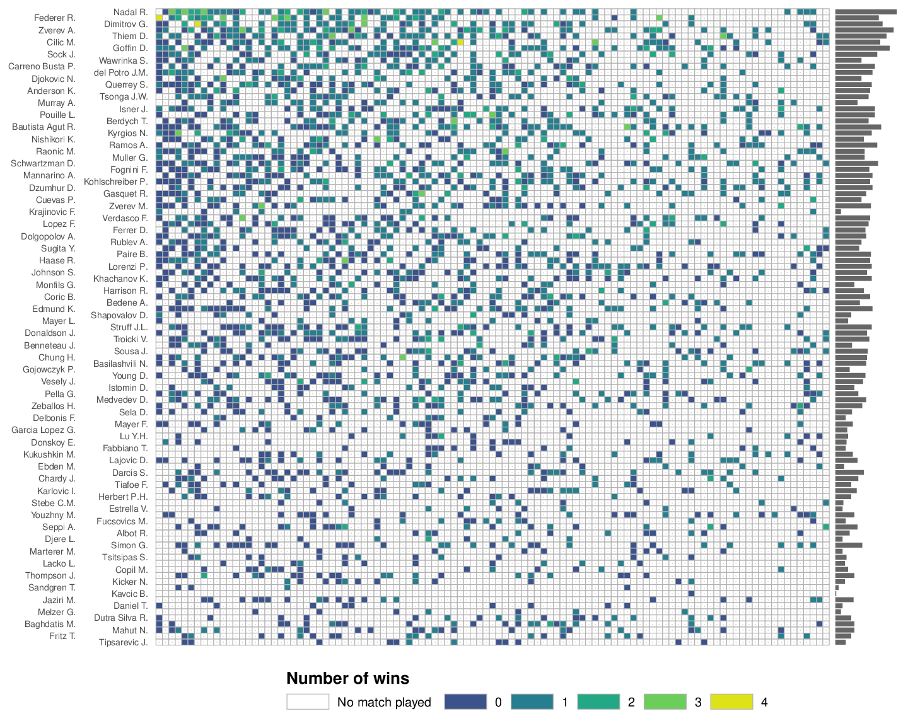</a> |
| `images/reordered_heatmap_point_estimatebw.pdf` | **Fig. 3** reordered adjacency matrix (VI, K = 3) | <a href="./images/reordered_heatmap_point_estimatebw.png">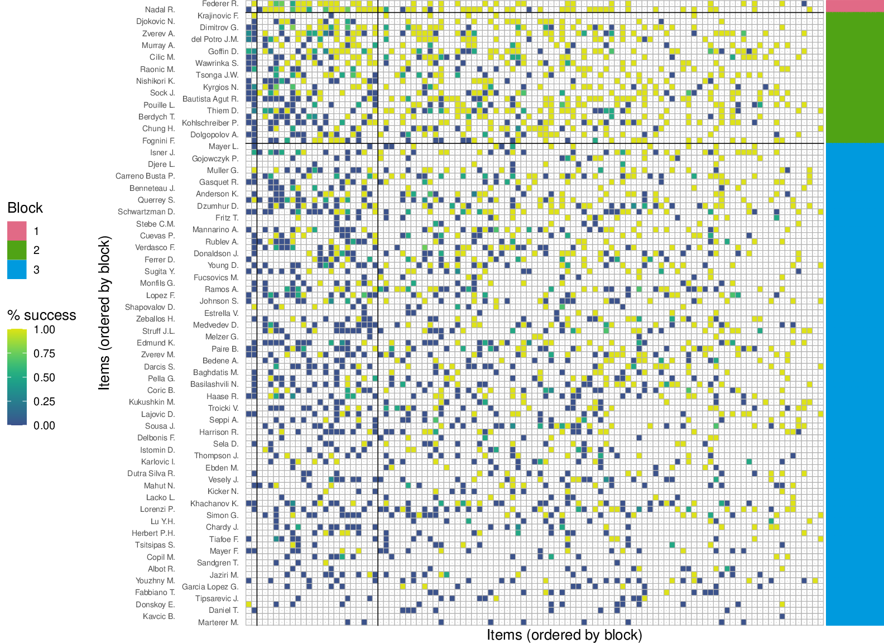</a> |
| `images/plot_ass.pdf` | **Fig. 4** posterior assignment probabilities | <a href="./images/plot_assignment.png">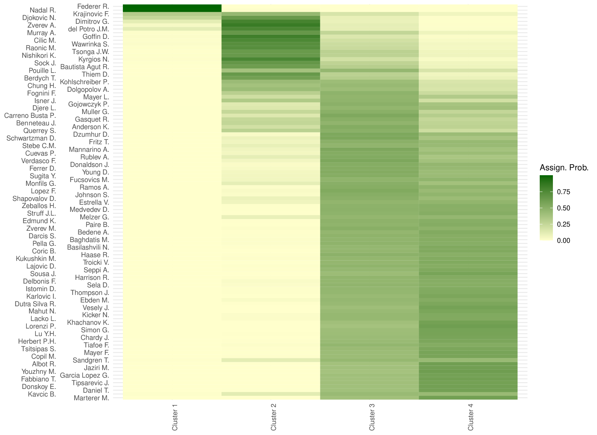</a> |
| `images/plot_rank.pdf` + `images/conditional_lambda_plot.pdf` | **Fig. 5** player ranking summaries | <a href="./images/plot_rank.pdf">plot_rank.pdf</a> and <a href="./images/conditional_lambda_plot.png">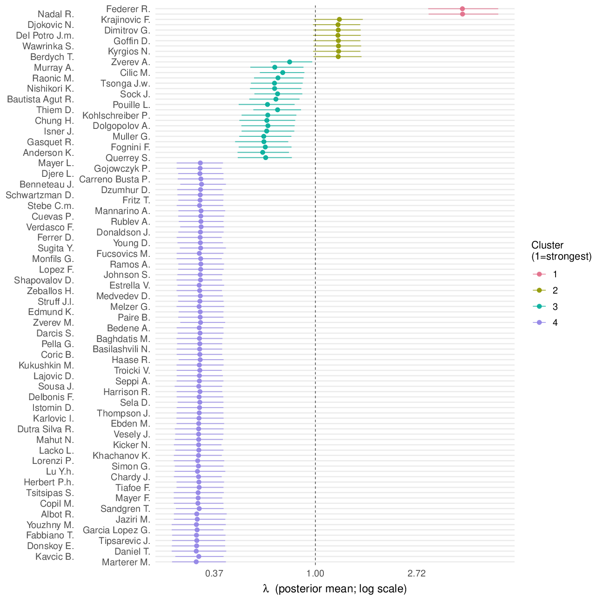</a> |
| `images/reordered_heatmap_v_ubbw.pdf`, `_v_lbbw.pdf`, `_horizbw.pdf` | **App. E** credible-ball boundary partitions | <a href="./images/reordered_heatmap_v_lbbw.png">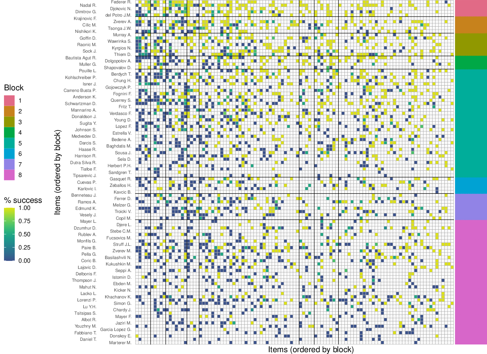</a> |

Table 3 (posterior distribution of K for 2017) is printed to the console by `single_season_analysis.R` and reported directly in the paper from those numbers.

### Step 3b — Multi-season analysis (2000–2025): Figs 6, 7, 8 and App. F table

```r
source("Multiple_seasons_analysis.R")
```

| Output | Paper element | Preview |
|---|---|---|
| `images/entropy_plot.pdf` | **Fig. 6** Shannon entropy across seasons | <a href="./images/entropy_plot.png">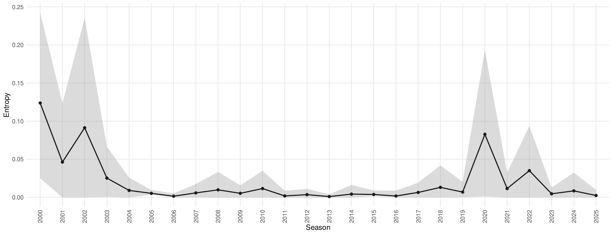</a> |
| `images/num_block_plot.pdf` | **Fig. 7** players in top block by season | <a href="./images/num_block_plot.png">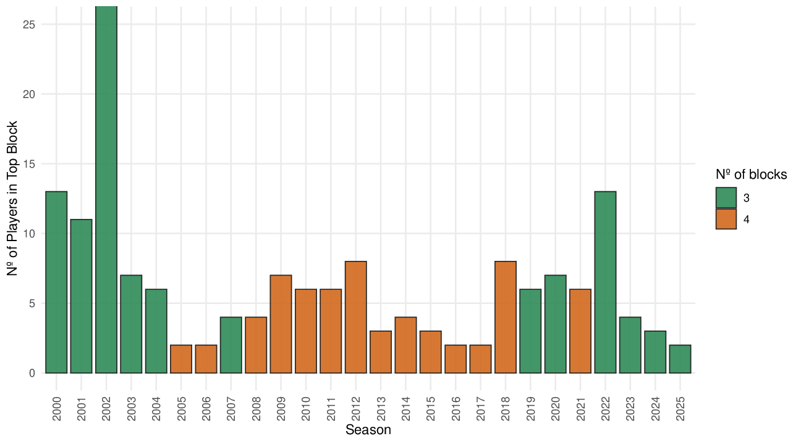</a> |
| `images/Ptop_across_time.pdf` | **Fig. 8** P(top block) for selected players | <a href="./images/Ptop_across_time.png">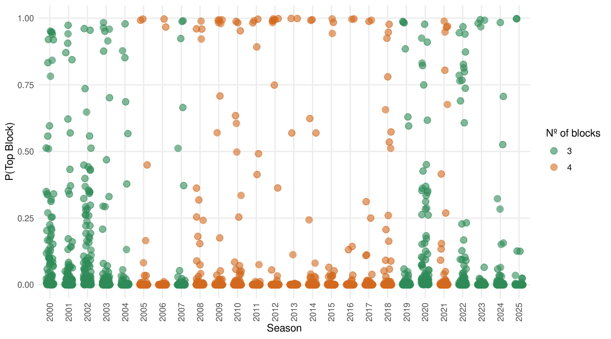</a> |
| `tables/post_numb_block_across_years_table1.tex` | **App. F** season-by-season posterior K | <a href="./tables/table_rendering_images/p_across_years_table.png">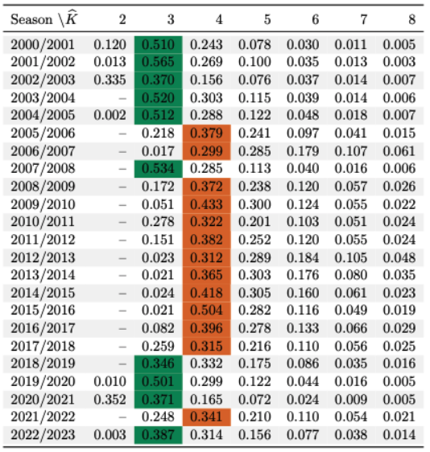</a> |

### Step 3c — Simulation study and RCBTL comparison: Tables 1 and 2

```r
source("RUN_SIMULATION_STUDY.R")
source("analyze_sim_study_results.R")
```

`RUN_SIMULATION_STUDY.R` generates synthetic win-loss matrices from the ATP-based design (three representative seasons: 2000, 2015, 2024), fits BT, RCBTL (Pearce & Erosheva 2025), and BT–SBM, and saves raw/merged outputs.

`analyze_sim_study_results.R` performs minimal post-processing only: it writes two separate tables and the ARI plot.

Parallelism is controlled via the `N_CORES` environment variable (default: all cores minus one). A lighter smoke-test run can be triggered with `N_RUNS=5`:

```bash
N_RUNS=5 Rscript RUN_SIMULATION_STUDY.R
Rscript analyze_sim_study_results.R
```

| Output | Paper element | Preview |
|---|---|---|
| `tables/table_btsbm_recovery_k357.tex` | **Table 1** *(main text)* BT–SBM recovery by K★ | <a href="./tables/table_rendering_images/table_preview_Sim3-7.png">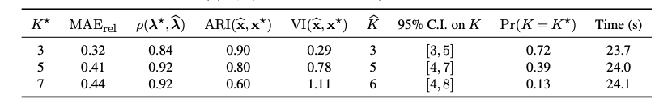</a> |
| `tables/table_rcbtl_baseline_one_run.tex` | **Table 2** *(main text)* baseline comparison | <a href="./tables/table_rendering_images/table_preview_RCBTL.png">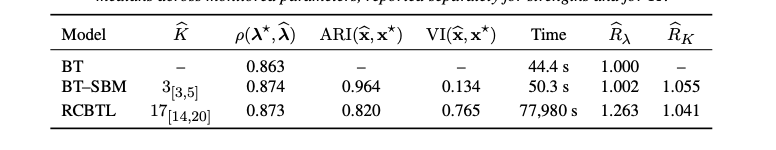</a> |
| `images/ARI_plot.png` | **App. D** ARI/VI performance plot | <a href="./images/ARI_plot.png">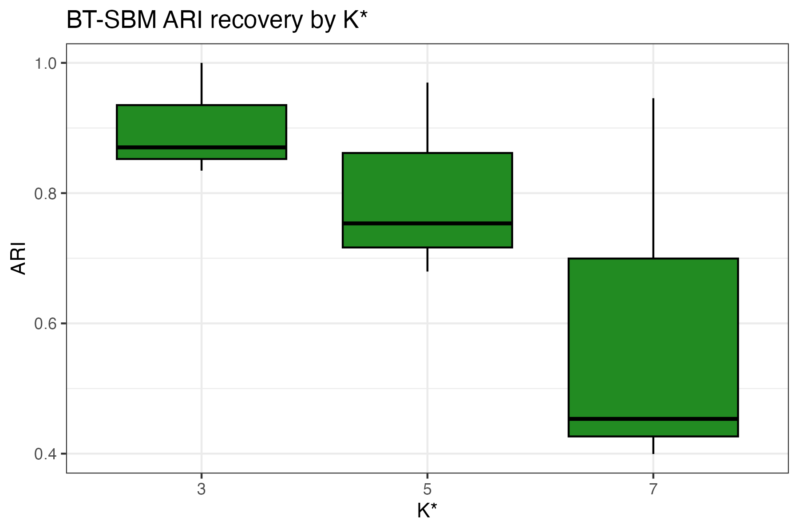</a> |

### Step 4a — Appendix F: LOO/ELPD model comparison across all seasons

```r
source("RUN_MODEL_COMPARISON_26_SEASONS_BT_vs_BTSBM.R")
```

Fits both the vanilla BT model and the BT–SBM to every season and computes LOO-CV ELPD differences. Supports incremental re-running: pass `"append"` on the command line (or set the environment variable `RUN_MODE=append_missing_last_n`) to add only missing seasons to `results/model_comparison_26_seasons_bt_vs_btsbm.csv` without recomputing the full history.

```bash
# Full re-run
Rscript "RUN_MODEL_COMPARISON_26_SEASONS_BT_vs_BTSBM.R"

# Append the three most recent seasons only
Rscript "RUN_MODEL_COMPARISON_26_SEASONS_BT_vs_BTSBM.R" append
```

| Output | Paper element | Preview |
|---|---|---|
| `images/DELPD_plot1.pdf` | **App. F** ΔELPD across seasons | <a href="./images/DELPD_plot1.png">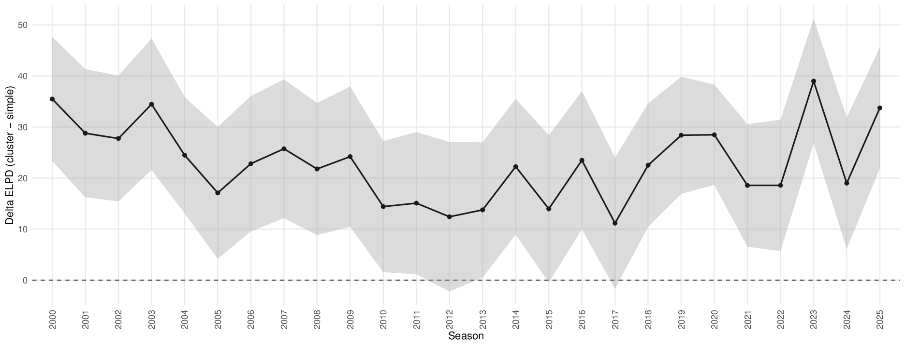</a> |
| `tables/model_comparison_by_season.tex` | **App. F** per-season LOO table | — |

### Step 4b — Prior sensitivity analysis (Appendix B)

```r
source("sensitivity_analysis.R")
```

Runs the BT–SBM under `a ∈ {1, 2, 3, 4}` on a simulated dataset and plots VI and posterior-K diagnostics.

| Output | Description |
|---|---|
| `results/sensitivity_a/boxplot_VI_by_a.png` | VI-to-truth by shape parameter `a` |
| `results/sensitivity_a/boxplot_K_by_a.png` | Posterior K distribution by `a` |
| `results/sensitivity_a/bar_posteriorK_by_a.png` | Bar chart of posterior K by `a` |
| `results/sensitivity_a/summary_by_a.csv` | Numerical summary |

> **Published App. B figures**: the analytical prior-sensitivity plots in the supplement (`pnew_lines_by_wi_faceted_by_zib1.png`, `pnew_lines_by_wi_faceted_by_zibpsia.png`) show the theoretical effect of `b` on the new-cluster probability. These are stored in `AOAS2193_Santi_final_files/images/` and were produced by a separate derivation script (not reproduced here).

---

## Reproducibility notes

- **Seed**: `RUN_application.R` sets `set.seed(1234)`. Running it once and keeping `raw_output_ext/MCMC_raw_output_ext.rds` is sufficient to reproduce all downstream figures and tables exactly.
- **MCMC settings**: 30 000 iterations, 5 000 burn-in, Gnedin prior with γ = 0.8 and Gamma(a = 2, b = exp(ψ(2))) strength prior. These defaults reproduce the main paper; they can be adjusted at the top of `RUN_application.R`.
- **Parallelism**: simulation scripts use `doParallel`/`foreach`; set the number of cores via `N_CORES` (defaults to `parallel::detectCores() − 1`).
- **Dependencies**: `BTSBM` imports are declared in its `DESCRIPTION`. Additional scripts use `ggplot2`, `ggrepel`, `cowplot`, `kableExtra`, `mcclust`, `mcclust.ext`, `mclust`, `coda`, `loo`, `rankclust`, and `readr`. LaTeX is required for table rendering.
- **Data**: ATP match data (2000–2025) is in `data/`. The extended 2026 dataset (`data/ATP_2000_2026_SN_extended.rds`) was added after paper acceptance; `single_season_analysis.R` uses it for the exploratory raw-adjacency plot only. The main MCMC analysis uses `data/ATP_2000_2025_SN_extended.rds`.
- **Legacy folder**: `legacy/` contains superseded scripts (old simulation and sensitivity code), HPC job launchers, and large old MCMC output files. The historical `Comparison with Pearce_Ereshova.R` script is archived there and is not needed by the current pipeline.

---

## How to cite

```bibtex
@article{SantiFriel2026BTSBM,
  title   = {Bradley--Terry Stochastic Block Models},
  author  = {Santi, Lapo and Friel, Nial},
  journal = {Annals of Applied Statistics},
  year    = {2026},
  note    = {DOI, volume, and page numbers yet to be received}
}
```

---

## License

See `LICENSE` in the repo root.
