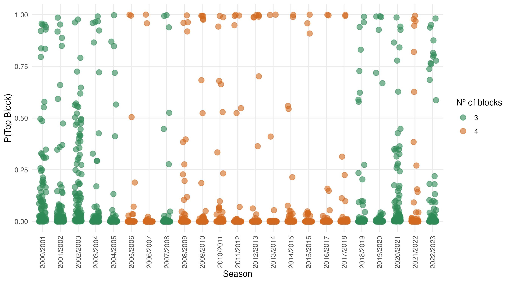

# **"Bradley–Terry meets Stochastic Block Models: Clustering Players from Pairwise Comparisons"**  

Lapo Santi, Nial Friel — University College Dublin

This repo now relies on the **`BTSBM`** R package for model implementation and MCMC.  
Here the code’s job is to *connect paper and results*—clean runs, saved outputs, and reproducible figures.

---

## 🔍 What’s inside (lean & focused)

- **Scripts at repo root**
  - `multiple_seasons_analysis.R` — runs all seasons, saves a single RDS.
  - `single_season_analysis.R` — deep-dive on one season.
  - `postprocessing.R` — reads saved results and generates all figures/tables.
- **`Pre-computed outputs**:
  - `results/` — serialized model results (`.rds`).
  - `images/` — figures used in the paper (PNG + a LaTeX table).

> If `results/` or `images/` are missing, the scripts will create them.

---

## ▶️ Multiple-Season Analysis

### 1) Install & load

```r
# install once (adjust to your GitHub origin if needed)
# install.packages("devtools")
devtools::install_github("laposanti/BTSBM")

library(BTSBM)
```

### 2) Run the sampler across seasons
Place yourself in the repo root and run:
```r
dir.create("results", showWarnings = FALSE, recursive = TRUE)
dir.create("images",  showWarnings = FALSE, recursive = TRUE)

source("multiple_seasons_analysis.R")
```

What it does:

- Iterates over all ATP seasons provided by BTSBM::ATP_2000_2022.

- Prints the season under analysis (with quick stats).

- Saves one file:

results/augmented_multiple_seasonsGN1.rds

### 3) Generate cross-season figures & tables

```r
source("postprocessing.R")
```

Outputs (preview below) are written to `images/`.

## ▶️ Single-Season Analysis

You can reproduce figures/tables for one season in isolation (e.g. useful for paper insets or diagnostics).

```r
dir.create("results", showWarnings = FALSE, recursive = TRUE)
dir.create("images",  showWarnings = FALSE, recursive = TRUE)

# choose the season index (yr), and the model tag in the saved RDS (e.g. "GN")
first_year <- 1999
yr         <- 18
model      <- "GN"

source("single_season_analysis.R")  # prints the season label and builds the figures

```

## 📊 Reproducing the Figures multi-season analysis
## 📊 Figures — Multiple Seasons (with inline previews)

The following table maps each figure in the paper to its generating code and output file, with a live thumbnail preview.

| Description | Script / Object | Preview | Output file |
|---|---|---|---|
| P(Top block) by season — jittered points | `postprocessing.R` / `p_top_across_time` | <a href="./images/Ptop_across_time.png"></a> | [`images/Ptop_across_time.png`](./images/Ptop_across_time.png) |
| Shannon entropy across seasons (mean with 90% band) | `postprocessing.R` / `entropy_plot` | <a href="./images/entropy_plot.png"></a> | [`images/entropy_plot.png`](./images/entropy_plot.png) |
| Nº of players in top block by season (bar chart) | `postprocessing.R` / `num_block_plot` | <a href="./images/num_block_plot.png"></a> | [`images/num_block_plot.png`](./images/num_block_plot.png) |

> All outputs are saved to the `images/` folder unless otherwise noted.  
> You can customize the output location by modifying the save paths in `postprocessing.R`.

---

## 🎯 Figures — Single-Season Analysis (with inline previews)

| Description | Script / Object | Preview | Output file |
|---|---|---|---|
| Posterior adjacency matrix (block-ordered) | `postprocessing.R` / `geom_adjacency_fixed` | <a href="./images/adjacency_reordered.png"></a> | [`images/adjacency_reordered.png`](./images/adjacency_reordered.png) |
| Assignment-probabilities heatmap (players × clusters) | `postprocessing.R` / `ass_prob_plot` | <a href="./images/assignment_uncertainty.png"></a> | [`images/assignment_uncertainty.png`](./images/assignment_uncertainty.png) |
| Player skill (λ) uncertainty — median + 90% HPD (log10) | `postprocessing.R` / `plot_lambda` | <a href="./images/lambda_uncertainty.png"></a> | [`images/lambda_uncertainty.png`](./images/lambda_uncertainty.png) |

> Tip: tweak the `width` attribute (e.g., `100–180`) if the thumbnails feel too small/large in your renderer.


🧪 Reproduce in one go

All seasons → results → figures:
```r
library(BTSBM)
dir.create("results", showWarnings = FALSE, recursive = TRUE)
dir.create("images",  showWarnings = FALSE, recursive = TRUE)

source("multiple_seasons_analysis.R")
source("postprocessing.R")
```

One season only (e.g. index 18):
```r
library(BTSBM)
first_year <- 1999; yr <- 18; model <- "GN"
dir.create("results", showWarnings = FALSE, recursive = TRUE)
dir.create("images",  showWarnings = FALSE, recursive = TRUE)

source("single_season_analysis.R")
```
