# Bradley–Terry Stochastic Block Models

**Lapo Santi, Nial Friel — University College Dublin**

This repository reproduces the paper’s results and relies on the R package **[`BTSBM`](https://github.com/laposanti/BTSBM)** for model implementation and MCMC.

---

## 🔍 What’s inside

**Root-level scripts**

* `RUN_MCMC.R` — fits the BT–SBM across the 22 ATP seasons in `BTSBM::ATP_2000_2022` and saves posterior draws.
* `multiple_seasons_analysis.R` — post-processes all seasons; writes figures and tables.
* `single_season_analysis.R` — post-processes a selected season; writes figures and tables.
* `Model_Comparison.R` — compares vanilla BT vs BT–SBM (ELPD-based) and saves plots/tables.

**Other folders**

* `simulation/` — code to reproduce the simulation study (Appendix D) and prior-sensitivity experiments.
* `results/` — raw outputs from `RUN_MCMC.R` (e.g., posterior samples, summaries).
* `images/` — figures used in the paper (PNG).
* `tables/` — paper tables (LaTeX, with rendered PNG previews under `tables/table_rendering_images/`).

> If `results/`, `images/`, or `tables/` are missing, the scripts will create them on first run.

---

## 1) Install & load

```r
# install once (adjust to your GitHub origin if needed)
# install.packages("devtools")
devtools::install_github("laposanti/BTSBM")

library(BTSBM)
```

> **Requirements.** R ≥ 4.2 recommended. See `BTSBM/DESCRIPTION` for imported packages (plotting via `ggplot2`; LaTeX required for table rendering).

---

## 2) Fit the model to all seasons

From the repository root, run:

```r
source("RUN_MCMC.R")
```

**What it does**

* Iterates over seasons in `BTSBM::ATP_2000_2022`.
* Prints progress with quick season stats.
* Writes the combined output to:

```
results/augmented_multiple_seasonsGN2.rds
```

> Set random seeds and MCMC settings inside `RUN_MCMC.R`. The script will create `results/` if needed.

---

## 3) Single-season analysis

Reproduce figures/tables for one season (useful for paper insets, diagnostics, replication checks):

```r
source("single_season_analysis.R")
```

### 📊 Outputs — Single-season

| Description                            | Script / Object                 | Preview                              | Output file                   |
| -------------------------------------- | ------------------------------- | -------------------------------------| ----------------------------- |
| Posterior adjacency matrix (Fig. 3)     | `postprocessing.R` / `reordered_heatmap` | <a href="./images/reordered_heatmap.png">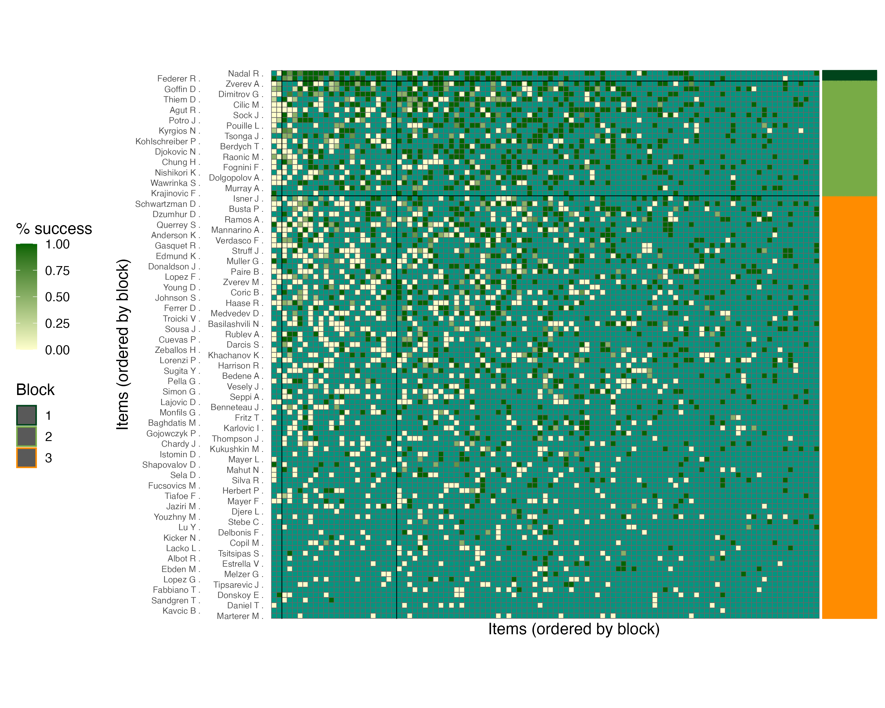</a>  | `images/reordered_heatmap.png`  |
| Assignment-probability heatmap (Fig. 4) | `postprocessing.R` / `ass_prob_plot`     | <a href="./images/ass_prob_plot.png">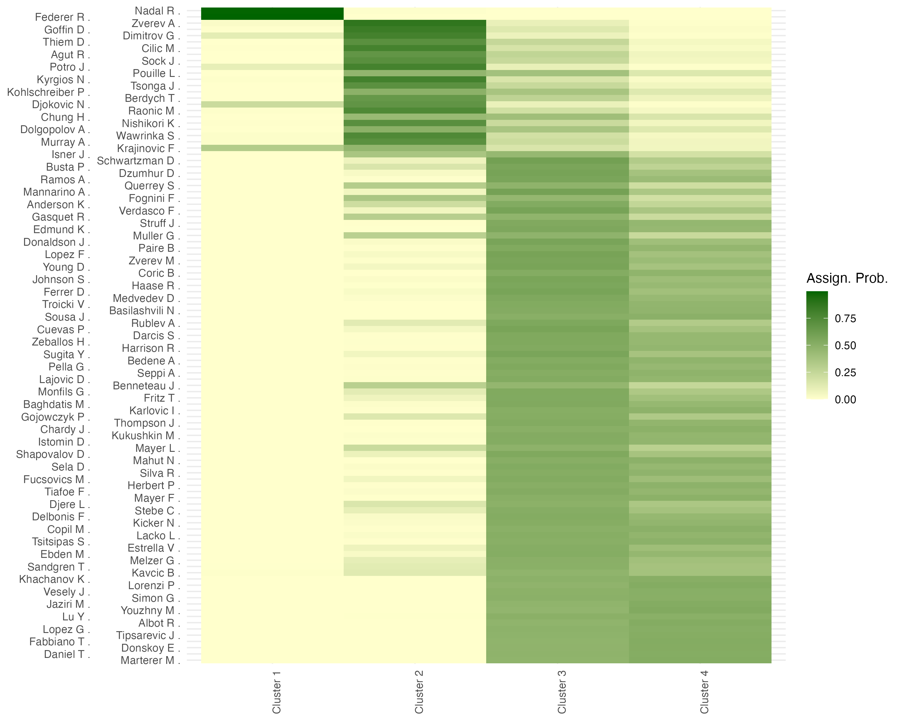</a>         | `images/ass_prob_plot.png`      |
| Player skill (λ) uncertainty (Fig. 5)   | `postprocessing.R` / `plot_lambda`       | <a href="./images/lambda_uncertainty.png">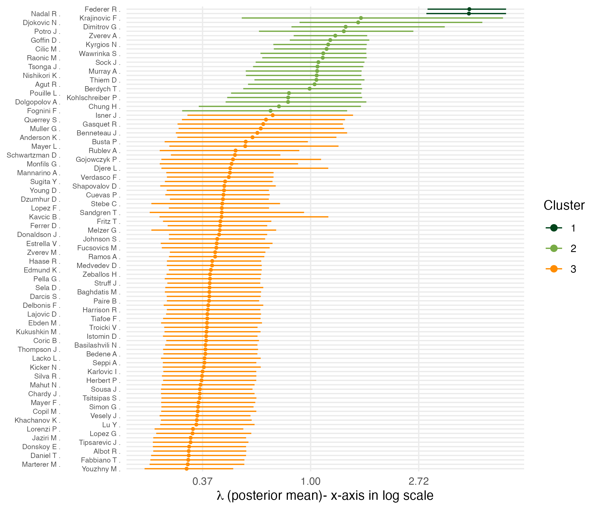</a>     | `images/lambda_uncertainty.png` |

---

## 4) Model comparison (BT vs BT–SBM)

```r
source("Model_Comparison.R")  # saves CSV and the plot used in Fig. 6
```

### 📊 Outputs — Model comparison

| Description                            | Script / Object                 | Preview                              | Output file                   |
| -------------------------------------- | ------------------------------- | -------------------------------------| ----------------------------- |
| Model comparison plot (ΔELPD) — Fig. 6 | `Model_Comparison.R`            | <a href="./images/DELPD_plot.png"></a>                                                                       | `images/DELPD_plot.png`       |
| Model comparison table                 | `Model_Comparison.R`            | <a href="./tables/table_rendering_images/model_choice_table.png">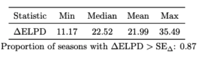</a>         | `tables/model_comparison.csv` |

---

## 5) Multiple-seasons analysis

Ensure your working directory is the project root, then run:

```r
source("multiple_seasons_analysis.R")
```

Outputs (previews below) are written to `images/` and `tables/`.

### 📊 Outputs — Multiple seasons

| Description                            | Script / Object                 | Preview                              | Output file                   |
| -------------------------------------- | ------------------------------- | -------------------------------------| ----------------------------- |
| Posterior K across seasons — Table 4           | `multiple_seasons_analysis.R` | <a href="./tables/table_rendering_images/p_across_years_table.png">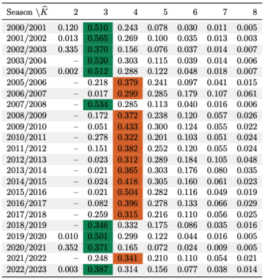</a>    | `tables/post_numb_block_across_years_table.tex`                                                            |
| No. of players in top block by season — Fig. 7 | `multiple_seasons_analysis.R` | <a href="./images/num_block_plot.png"></a>                                                                   | `images/num_block_plot.png`                                                                                |
| P(Top block) by season — Fig. 8                | `multiple_seasons_analysis.R` | <a href="./images/Ptop_across_time.png"></a>                                                             | `images/Ptop_across_time.png`                                                                              |
| Shannon entropy across seasons — Fig. 9        | `multiple_seasons_analysis.R` | <a href="./images/entropy_plot.png">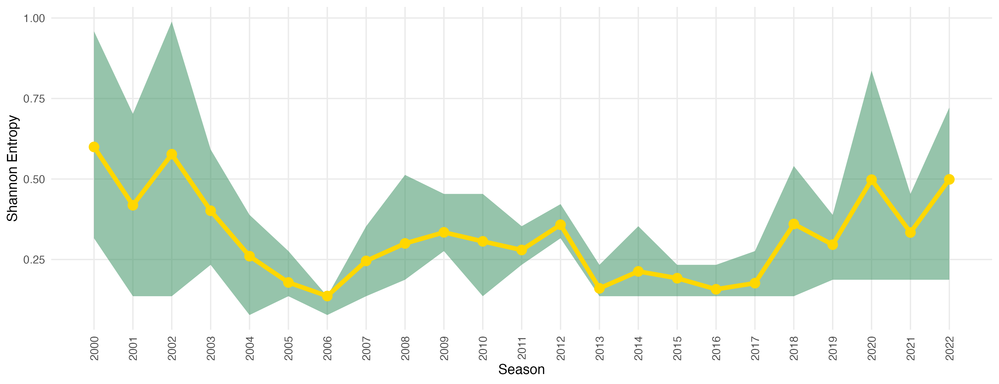</a>                                                                     | `images/entropy_plot.png`                                                                                  |

> From Table 4, the 2017/2018 row corresponds to Table 2 in the paper.

---

## 6) Appendix — Prior sensitivity

From the project root, run:

```r
source("simulation/simulation.R")
```

### 📊 Outputs — Prior sensitivity

| Description                            | Script / Object                 | Preview                              | Output file                   |
| -------------------------------------- | ------------------------------- | -------------------------------------| ----------------------------- |
| Prior sensitivity table — Table 5                | `simulation/simulation.R`     | <a href="./tables/table_rendering_images/prior_table.png">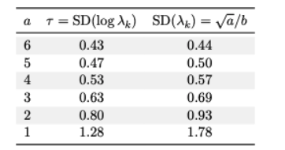</a>                | `tables/prior_sensitivity.csv`    |
| Prior sensitivity plot (b = exp(ψ(a))) — Fig. 10 | `simulation/simulation.R`     | <a href="./images/hyperprior_plots/prior_b_exp_psi_a.png">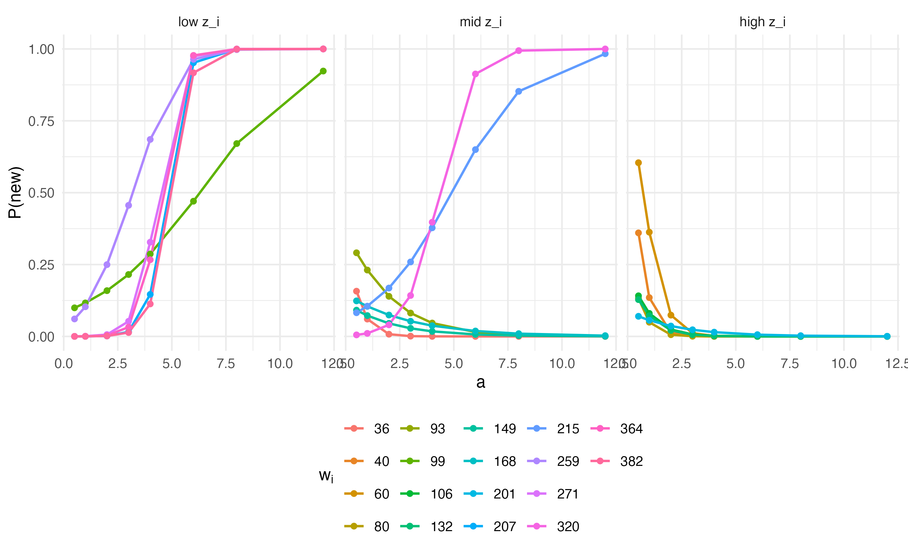</a>               | `images/prior_sens_b_exp_psi.png` |
| Prior sensitivity plot (b = 1) — Fig. 11         | `simulation/simulation.R`     | <a href="./images/hyperprior_plots/prior_b_one.png"></a>                                   | `images/prior_sens_b1.png`        |

> Plots are saved to `images/`, tables to `tables/`.

---

## 7) Appendix — Simulation study

From the project root, run:

```r
source("simulation/simulation.R")
```

### 📊 Outputs — Simulation study

| Description                            | Script / Object                 | Preview                                   | Output file                   |
| -------------------------------------- | ------------------------------- | ------------------------------------------| ----------------------------- |
| Contingency table — Table 6 | `simulation/simulation.R`     | <a href="./tables/table_rendering_images/contingency_table.png">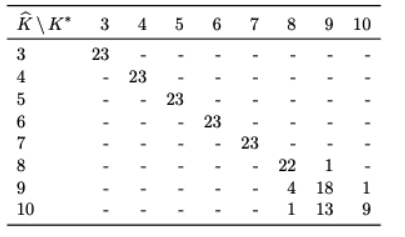</a>         | `tables/contingency_table.tex` |
| ARI plot — Fig. 12          | `simulation/simulation.R`     | <a href="./images/ARI_plot.png">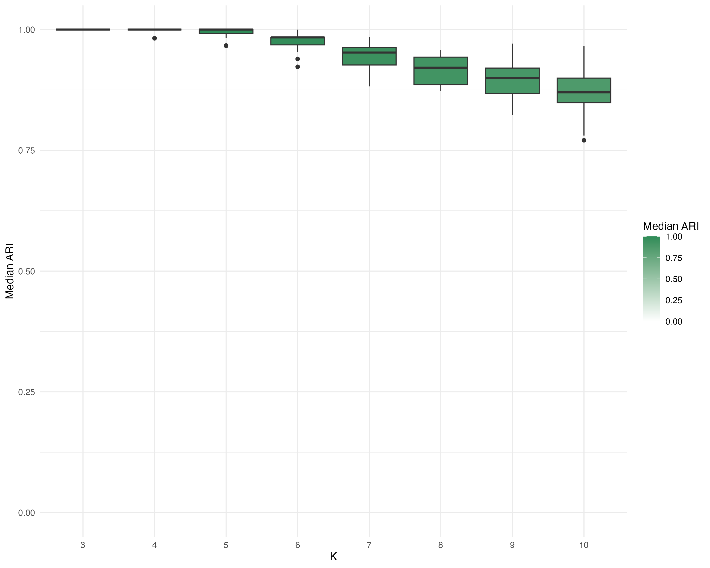</a>                                                                                  | `images/ari_plot.png`          |

> As above, plots go to `images/`, tables to `tables/`. Paths are configurable in `postprocessing.R`.

---

## 8) Appendix — 95% Credible Bounds

From the project root, run:

```r
source("single_season_analysis.R")
```

### 📊 Outputs — Reordered adjacency matrices with alternative partitions within the same credible ball

| Description                            | Script / Object                 | Preview                                   | Output file                   |
| -------------------------------------- | ------------------------------- | ------------------------------------------| ----------------------------- |
| Vertical upper bound     | `single_season_analysis.R`     | <a href="./images/reordered_heatmap_v_ub.png">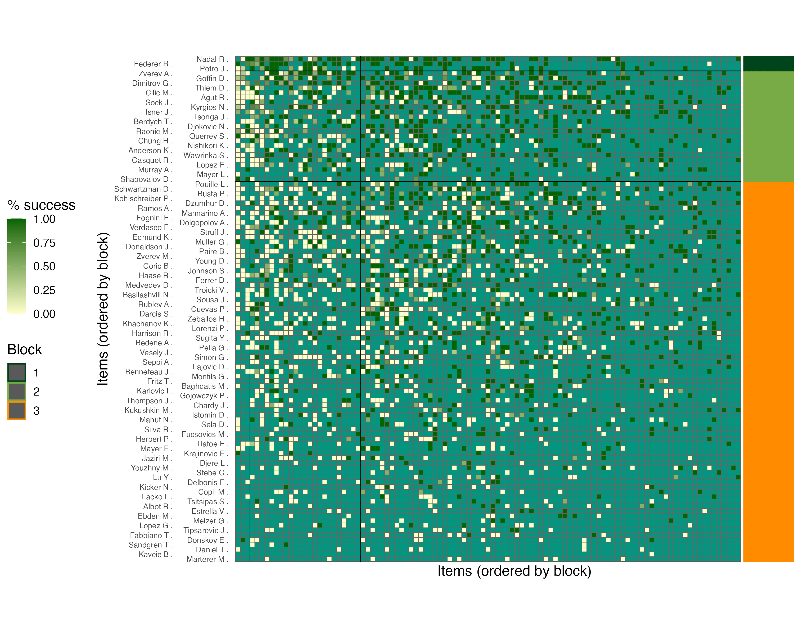</a>                                     | `images/reordered_heatmap_v_ub.png`  |
| Vertical lower bound     | `single_season_analysis.R`     | <a href="./images/reordered_heatmap_v_lb.png">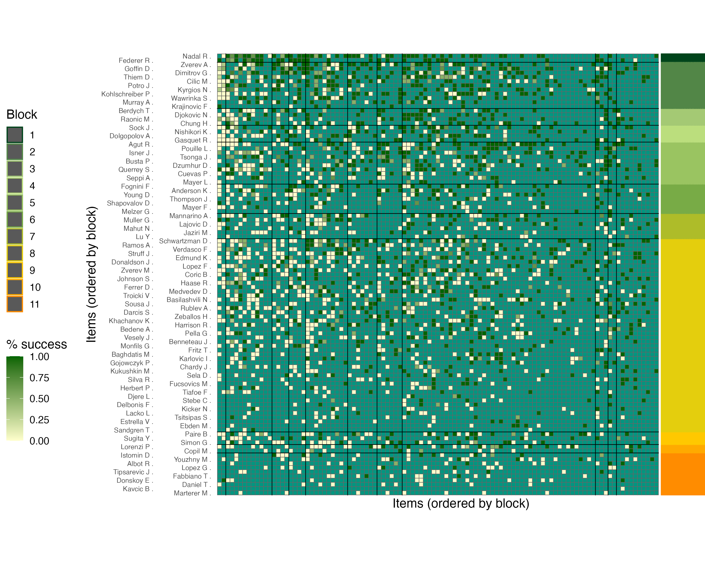</a>                                     | `images/reordered_heatmap_v_lb.png`  |
| Horizontal bound         | `single_season_analysis.R`     | <a href="./images/reordered_heatmap_horiz.png">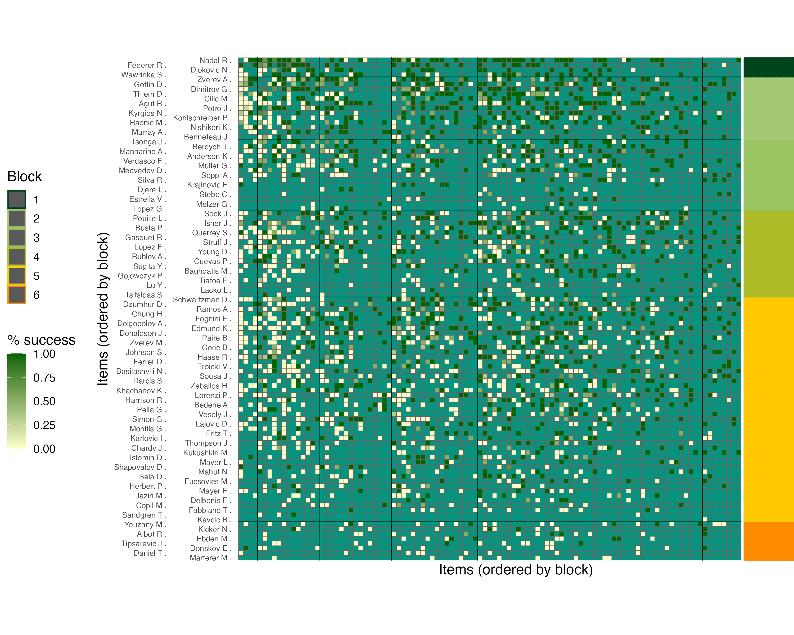</a>                              | `images/reordered_heatmap_horiz.png` |

> As above, plots go to `images/`, tables to `tables/`.

---

## Reproducibility & notes

* **Seeds & chains**: set RNG seeds, number of iterations, burn-in, and thinning inside the scripts (`RUN_MCMC.R`, `postprocessing.R`).
* **Parallelism**: computations are parallelized where possible (see comments in `RUN_MCMC.R`). Adjust the number of cores for your machine.
* **Dependencies**: see the `DESCRIPTION` of the `BTSBM` package for imports. Plotting relies on `ggplot2`; table rendering uses LaTeX.
* **Session info**: for strict reproducibility, consider saving `sessionInfo()` when writing results.

---

## How to cite

If you use this code, please cite the paper and the package:

```bibtex
@article{SantiFrielBT_SBM,
  title   = {Bradley--Terry Stochastic Block Models},
  author  = {Santi, Lapo and Friel, Nial},
  journal = {XXXX},
  year    = {XXXX},
  note    = {Preprint / in review}
}
```

---

## License

See `LICENSE` in the repo root.
